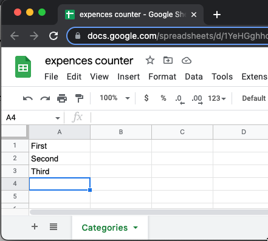
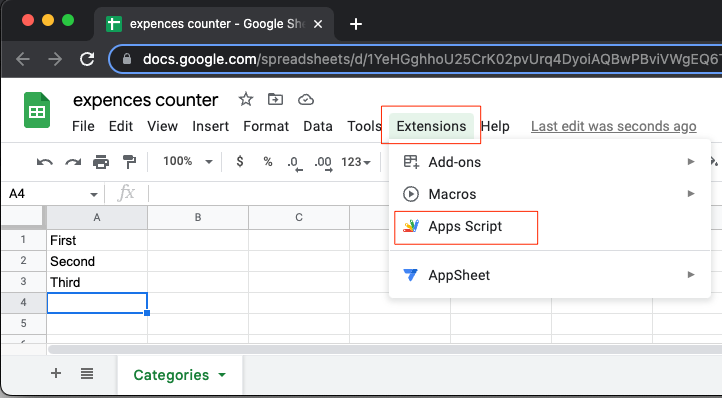
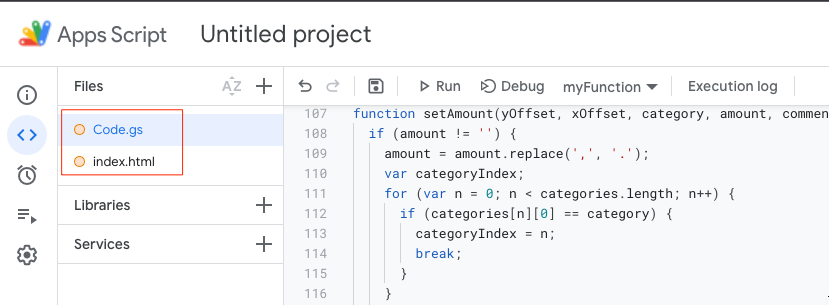
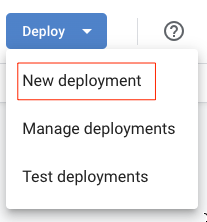
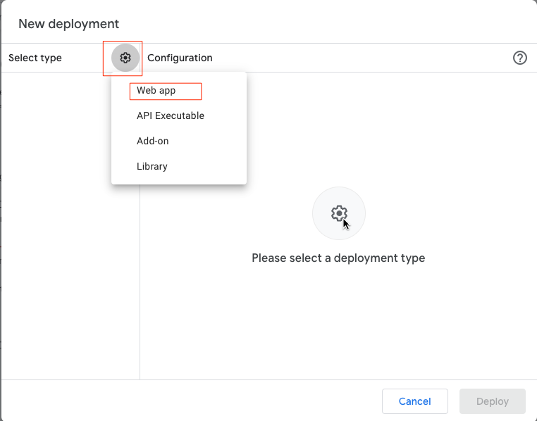
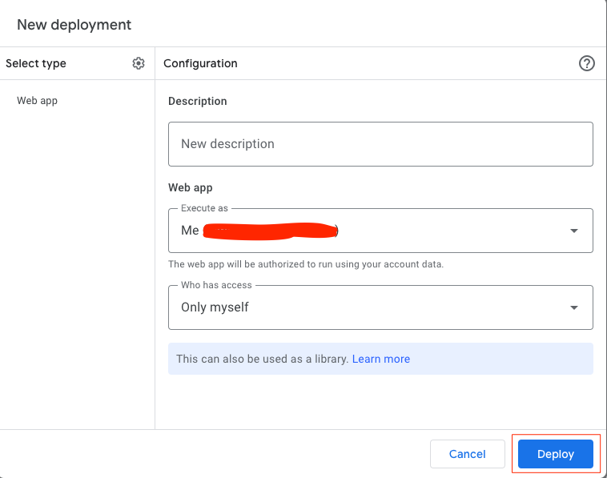
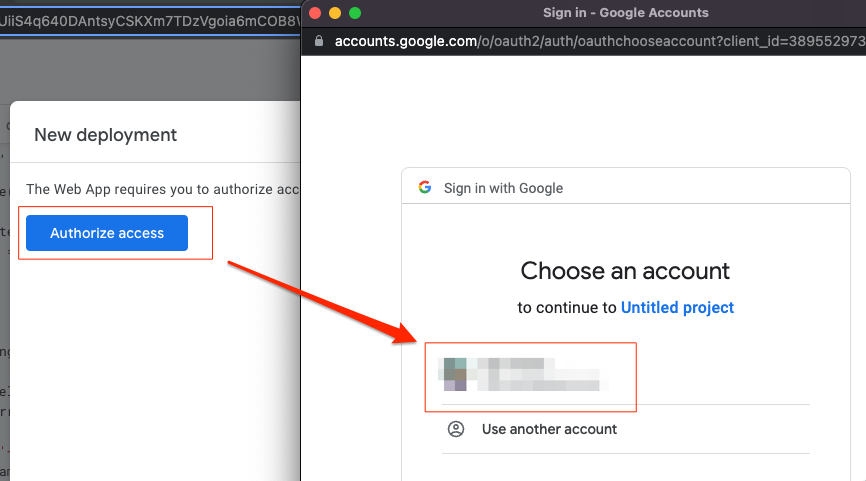
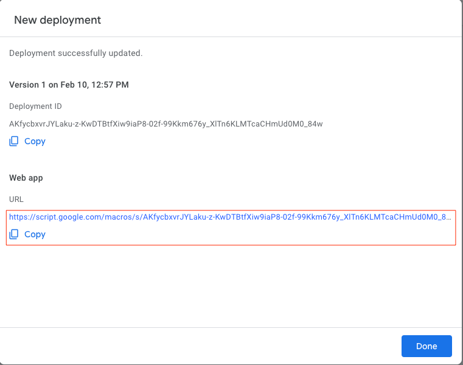

# Expences_accounter

### Installation instructions

* Create google sheet
* Create a tab 'Categories'
* Populate it with your expences categories 
* Go to `Extensions` -> `Apps script` 
* Create files `Code.gs` and `index.html` 
* Paste contents of corresponding files from this project
* Click `Deploy` -> `New deployment` 
* Select type `Web app` 
* Set:
    * `Execute as`: `Me`
    * `Who can access`: `Only myself` 
* Deploy the app and authorize
     
* Use provided URL 
* Confirm access of this project to your google drive:

In some cases it takes time for the script to start working properly: https://support.google.com/docs/thread/99474963

### TODO

* Use case 'a category is added':
  * insert row with new category
  * add `total` formula for this row
  * assure all other formulas consider new row
  * redraw backgrounds for categories rows
* Use case a category is removed
